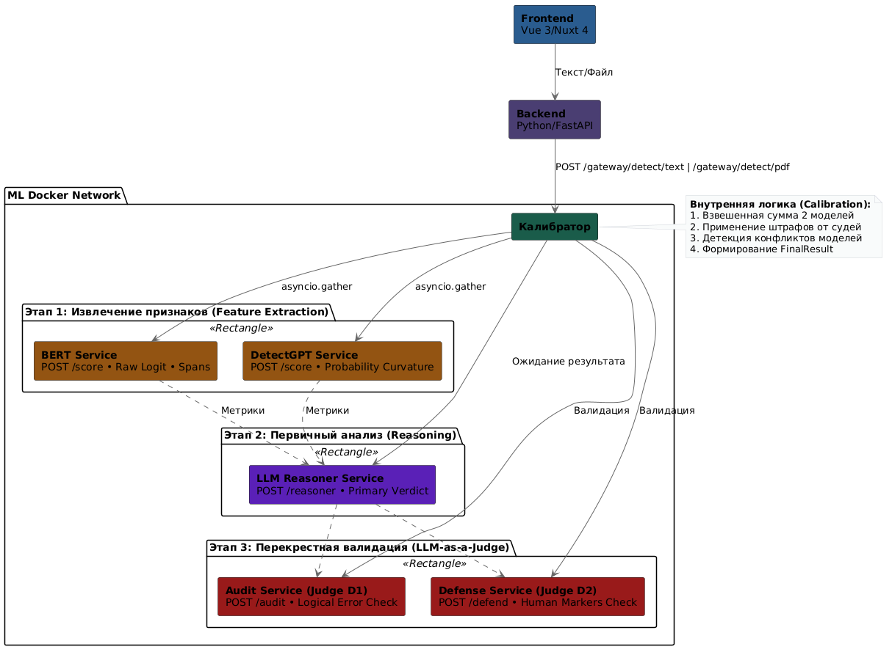

# 🔍 AIdetect — Система идентификации сгенерированного текста

<div align="center">
  
  
  
  
  
</div>

<br />

> **AIdetect** — это программный сервич на базе гибридной ML-архитектуры для выявления искусственно сгенерированных текстов в академической среде. Проект разработан в рамках магистерской работы.

## Ключевые возможности

*   **Гибридный анализ:** Совместное использование семантического анализа и вероятностной кривизны.
*   **LLM-as-a-Judge:** Уникальная система перекрестной валидации. Нейросетевые "судьи" (Аудитор и Адвокат) оценивают логику и ищут "человеческие маркеры" для снижения ложных срабатываний.
*   **Интерпретируемый ИИ:** Система не просто выдает процент, а подсвечивает конкретные предложения (Spans), сгенерированные машиной, прямо в тексте.
*   **Поддержка документов:** Автоматический парсинг загружаемых файлов в формате `.pdf` с имитацией прогресса загрузки.
*   **Современный UI/UX:** Темная/Светлая темы, эффекты матового стекла, плавная анимация переходов на базе Nuxt 4 и Shadcn Vue.

---

## Архитектура системы

Проект построен на базе строгой микросервисной архитектуры. Контейнеры общаются в закрытой Docker-сети, наружу проброшены только безопасные шлюзы.

<!-- 💡 СЮДА ВСТАВЬ КАРТИНКУ: Экспортируй схему из PlantUML (которую мы делали ранее для презентации) -->


### Компоненты:
1.  **Frontend (Nuxt 4 / Vue 3):** Реактивный пользовательский интерфейс с SSR.
2.  **API Gateway (FastAPI):** Внешний шлюз для обработки запросов, загрузки файлов.
3.  **Calibrator (FastAPI):** Оркестратор аналитического контура. Управляет асинхронным запуском моделей и сливает их результаты.
4.  **ML Experts:** Изолированные воркеры (`BERT Service`, `DetectGPT Service`, `LLM Reasoner`), выполняющие тяжелые вычисления на GPU/CPU.

---

## Быстрый старт (Docker)

Для запуска всей системы локально вам потребуется только установленный **Docker** и **Docker Compose**.

### 1. Клонирование репозитория
```bash
git clone https://github.com/your-repo/ai-detector-system.git
cd ai-detector-system
```

### 2. Настройка переменных окружения
Создайте файл `.env` в корне проекта и добавьте необходимые API-ключи:
```env
YANDEX_API_KEY=ваш_ключ_здесь
YANDEX_FOLDER_ID=ваш_id_здесь
```

Скачайте модель Bert из нашего [ЯндексДиска](https://disk.360.yandex.ru/d/N_bTt2DOG_FoHQ), и положите все содержимое по пути ./backend/bert_service/bert_model

### 3. Запуск одной командой
```bash
docker compose up --build -d
```
*При первом запуске Docker скачает образы языковых моделей (BERT, GPT-2, T5), что может занять несколько минут. Дождитесь статуса `(healthy)` для всех контейнеров.*

### 4. Доступ к приложению
*   **Веб-интерфейс:** [http://localhost:3000](http://localhost:3000)
*   **API Gateway (Swagger):** [http://localhost:8004/docs](http://localhost:8004/docs)

---

## Структура проекта

```text
ai-detector-system/
├── frontend/               # Клиентское приложение (Nuxt 4, Vuex, Tailwind, Shadcn)
├── backend/                # Микросервисы (FastAPI)
│   ├── external_service/   # Внешний шлюз API
│   ├── calibrator_service/ # Агрегатор и логика калибровки
│   ├── bert_service/       # Инференс модели Bert
│   ├── detectgp_service/   # Инференс алгоритма DetectGPT
│   └── llm_arbiter_service/# Сервис "судей" (Reasoner, Audit, Defense)
├── ml/                     # Research-ноутбуки, парсеры и скрипты обучения
├── docker-compose.yml      # Основной манифест оркестрации
└── .env.example            # Шаблон переменных окружения
```

---

## Научный базис
Модели обучены на собственном параллельном корпусе текстов, собранном на базе открытой научной библиотеки **CyberLeninka** (статьи до 2018 года).
Особое внимание уделено детекции текстов с **низкой перплексией** и монотонной структурой, что является главным отличием машинно-сгенерированных текстов в академическом стиле.

Итоговые датасеты на [ЯндексДиске](https://disk.360.yandex.ru/d/h8GPfQB_BtsRjA)

---

## Авторы
*   **[Аладинский Георгий / Goga270]**
*   **[Мандал Дмитрий / dmitrybot]**
*   **[Панов Артем / arsepan]**
